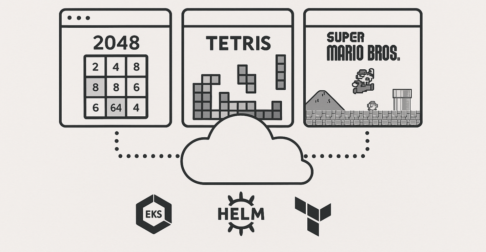

# EKS Playground: Tetris, Mario, and 2048 Walk into a Cluster...



This guide walks you through deploying 3 classic games to Amazon EKS using the AWS Load Balancer Controller. It includes cluster creation, deploying the application, configuring ingress, and clean-up instructions.

## 1. Create the EKS Cluster

Provision the EKS cluster using `eksctl`. This process may take approximately 15 minutes.

```sh
eksctl create cluster -f ./k8s/cluster-config.yaml

# cluster-config.yaml -------------
# apiVersion: eksctl.io/v1alpha5
# kind: ClusterConfig

# metadata:
#   name: cluster-2048
#   region: us-east-1

# nodeGroups:
#   - name: nodes-2048
#     instanceType: t3.small
#     desiredCapacity: 2
#     minSize: 2
#     maxSize: 4
#     spot: true
```

This command also updates your `kubeconfig` automatically.

Verify that your context is correctly set:

```sh
kubectl config current-context

kubectl get nodes
```

## 2. Deploy the Application and Ingress Resources

Apply the namespace, deployment, and service definitions:

```sh
cd k8s/manifests/
k apply -f namespace.yaml
k apply -f 2048_manifests.yaml
k apply -f tetris_manifests.yaml
```

To verify that so far the deployment is working just fine, we should be able to access the games via `<NODE_EXTERNAL_IP>:<NodePort>`.
In the corresponding manifests, we've set `nodePort` for the apps to 32321 and 32322.
Ensure the EC2 node's security group allows inbound traffic to the NodePort.
Access the app: `http://<NODE_PUBLIC_IP>:<NodePort>`

```sh
$ k get svc -n $this_ns
NAME             TYPE       CLUSTER-IP       EXTERNAL-IP   PORT(S)        AGE
service-2048     NodePort   10.100.9.229     <none>        80:32321/TCP   19m
service-tetris   NodePort   10.100.120.140   <none>        80:32322/TCP   11m

# To get the external-ip of the node isntances:
$ k get nodes -o wide
```


Apply the ingress resource:

```sh
kubectl apply -f ingress.yaml
```

Check the status of the ingress:

```sh
kubectl get ing -n $this_ns
```

> **Note:** Initially, there will be no public address for the ingress resource. The AWS Load Balancer Controller will create and configure a LoadBalancer based on the ingress specifications. We will create one shortly.


## 4. Configure IAM Roles for Service Accounts (IRSA)

### Download IAM Policy for AWS Load Balancer Controller

```sh
curl -O https://raw.githubusercontent.com/kubernetes-sigs/aws-load-balancer-controller/v2.11.0/docs/install/iam_policy.json
```

### Create IAM Policy

```sh
aws iam create-policy \
  --policy-name AWSLBControllerIAMPolicy \
  --policy-document file://iam_policy.json
```

### Associate IAM OIDC Provider with the Cluster

```sh
eksctl utils associate-iam-oidc-provider \
  --region $this_region \
  --cluster $this_cluster \
  --approve
```

### Create Service Account with IAM Role

```sh
eksctl create iamserviceaccount \
  --cluster $this_cluster \
  --namespace kube-system \
  --name aws-lb-ctl \
  --role-name AWSEKSLBControllerRole \
  --attach-policy-arn arn:aws:iam::<AccountID>:policy/AWSLBControllerIAMPolicy \
  --approve
```

## 5. Install AWS Load Balancer Controller Using Helm

### Add and Update Helm Repository

```sh
helm repo add eks https://aws.github.io/eks-charts
helm repo update eks
```

### Get the VPC ID for the Cluster

```sh
this_vpc=$(aws eks describe-cluster \
  --name "$this_cluster" \
  --region "$this_region" \
  --query "cluster.resourcesVpcConfig.vpcId" \
  --output text)
```

### Install the Controller

```sh
helm install aws-lb-controller eks/aws-load-balancer-controller \
  -n kube-system \
  --set clusterName=$this_cluster \
  --set serviceAccount.create=false \
  --set serviceAccount.name=aws-lb-ctl \
  --set region=$this_region \
  --set vpcId=$this_vpc
```

## 6. Verify Load Balancer and Access the Application

### Check the Controller Pods

```sh
kubectl get pods -n kube-system -l app.kubernetes.io/name=aws-load-balancer-controller
```

### Retrieve the Ingress Address

```sh
kubectl get ing -n $this_cluster
```

As we're just testing and don't necessarily want to incur additional costs by buying a domain, we can use free DNS services - such as `nip.io` or `sslip.io` - that map IPs directly into domain names.

For that we need to re-configure to the ingress resource with the EXTERNAL IP of the ALB's DNS (ADDRESS field in the command above).

```sh
# Get the EXTERNAL IP of the ALB:
nslookup <ALB_DNS_name>


cat k8s/manifests/ingress.yaml | grep nip.io
#  - host: tetris.<ALB_EXTERNAL_IP>.nip.io
#  - host: 2048.<ALB_EXTERNAL_IP>.nip.io


# re-configure the ingress
kubectl apply -f k8s/manifests/ingress.yaml
```

Now, the app should be accessible via the address specified in the `host` in ingress.

## 7. (Optional) Accessing via NodePort

In the meantime you can access the service via NodePort:

## 8. Clean Up Resources

To avoid incurring charges, delete the EKS cluster once you’re done:

```sh
eksctl delete cluster --config-file=k8s/cluster-config.yaml
```

> **Note:** After deletion, visit the CloudFormation console and manually remove any residual stacks associated with the cluster.
